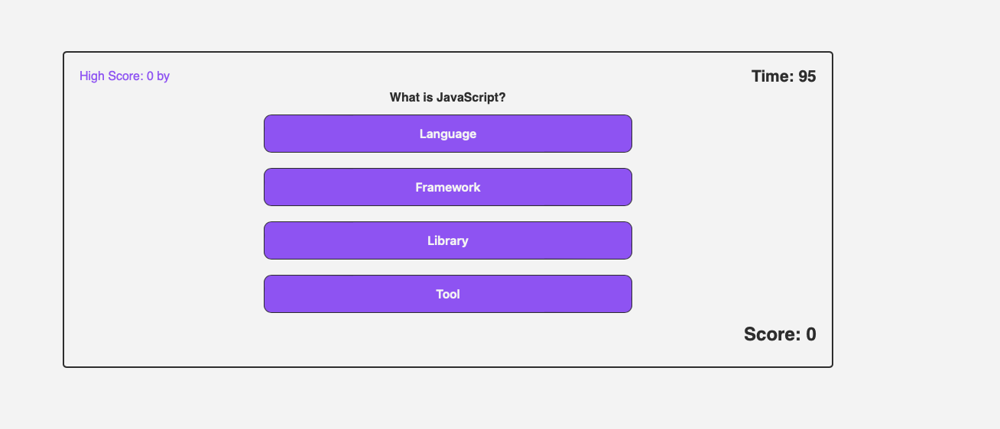
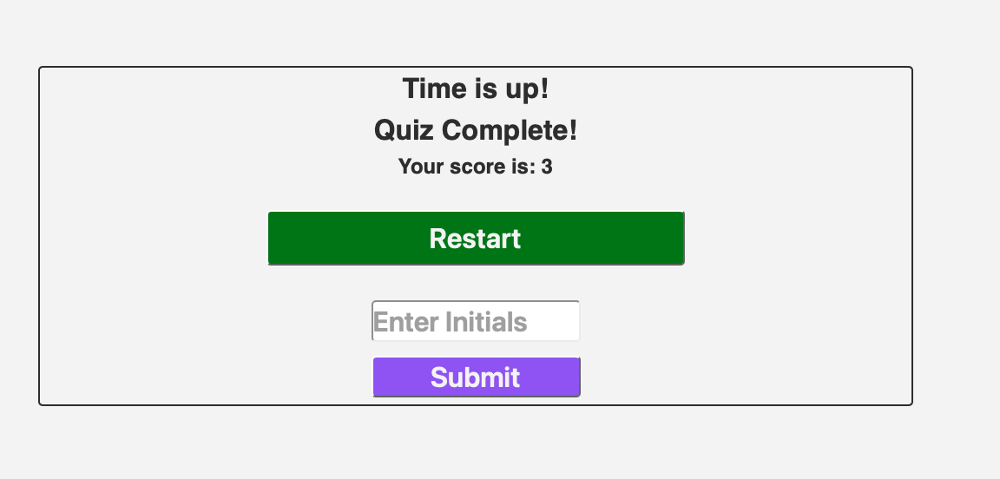

# Code Quiz App

This web application is used to generate a password with the criterias that are defined by the user

## Table of Contents

- [Installation](#installation) 
- [Usage](#usage) 
- [Features](#features) 
- [Contributing](#contributing)
- [License](#license)
- [Credits](#credits)
- [Contact](#contact)

## Installation
 - N/A

## Usage

- click the link - https://kenneilsmith.github.io/code_quiz_app_module4/

## Features

- A user will be able to challenge their javascript knowledge
- A user will answer 10 question about javascript in a specific time
- If the user answers a question correctly then points will be added to their score
- If the user answer incorrectly time will be deducted from their remainding time
- At the end of the game the user will be able to store their score

## License

This project is licensed under the MIT License.

## Credits
   -  JD Todlock - Bootcamp Instructor 
   -  Justyn Subrai - Bootcamp TA
   -  Paul Cwik - Bootcamp TA 

## Contact

Damian Smith - damiansmith61@gmail.com \
Project Link: https://github.com/kenneilsmith/code_quiz_app_module4
